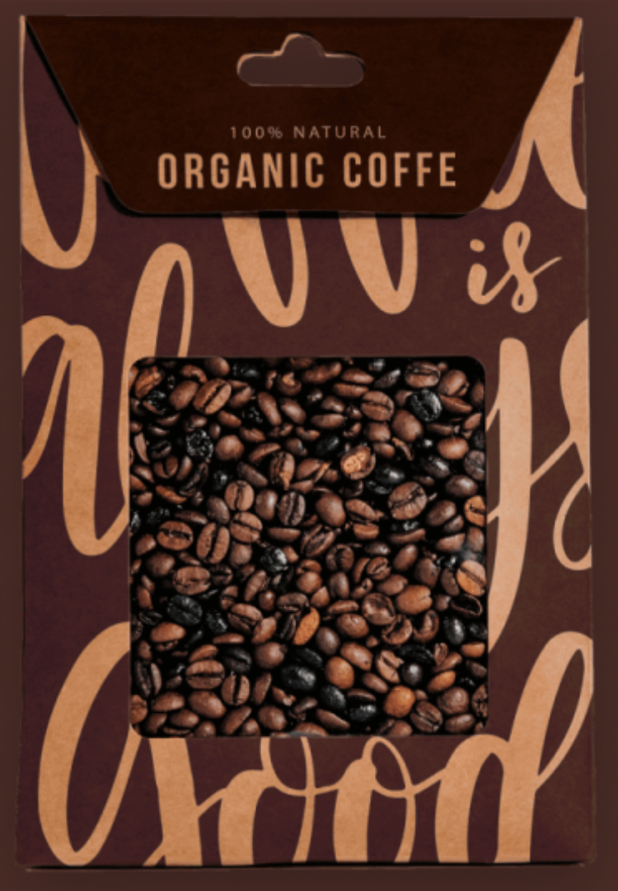

# ☕ Confetto Coffee Grid Layout

[](https://developer.mozilla.org/en-US/docs/Web/HTML)
[](https://tailwindcss.com/)

My first experiment with CSS Grid! A responsive product display section for Confetto Coffee, built with HTML and Tailwind CSS.


<div style="float: right; margin: 40px 0 0 20px;">
  
</div>

## ✨ Features
- **CSS Grid Layout**: First-time implementation of grid for product cards
- **Responsive Design**: Flexbox fallback with `md:flex` for smaller screens
- **Consistent Styling**: Uniform coffee product cards with pricing
- **Custom Colors**: Using `#291812` (dark brown) and `#472E27` (medium brown)

## 🧠 What I Learned
- How to structure content with **nested grid/flex layouts**
- **Responsive considerations** when combining grid and flexbox
- **Image-text alignment** in product cards
- **Tailwind utility classes** for rapid prototyping

## 🛠️ Tech Stack
```html
<div class="coffee">
  <div class="coffee-item">
    
    <p>Classic Coffee<br>$17.90</p>
  </div>
  <!-- Repeatable grid items -->
</div>
